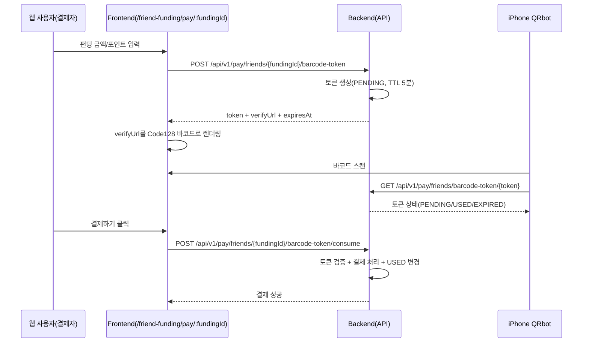

# QRbot(Code128) 테스트 흐름

## 개요
- 친구 펀딩 결제 페이지에서 **1회용 결제 토큰**을 발급합니다.
- 서버는 토큰으로 **검증 URL**을 만들고, 프론트는 해당 URL을 **Code128 바코드**로 렌더링합니다.
- iPhone QRbot으로 바코드를 스캔하면 URL 또는 토큰 값을 얻을 수 있고, 서버 검증 API로 상태를 확인할 수 있습니다.

## 시퀀스 다이어그램

## API 요약
- 토큰 발급: `POST /api/v1/pay/friends/{fundingId}/barcode-token`
- 토큰 검증(무인증): `GET /api/v1/pay/friends/barcode-token/{token}`
- 토큰 결제 소모: `POST /api/v1/pay/friends/{fundingId}/barcode-token/consume`

## QRbot 테스트 절차
1. 웹에서 로그인 후 `친구 펀딩 결제 페이지`로 이동합니다.
2. 펀딩 금액/포인트를 입력하면 바코드가 생성됩니다.
3. iPhone QRbot으로 바코드를 스캔합니다.
4. 스캔 결과가 URL이면 바로 열어서 토큰 상태(JSON)를 확인합니다.
5. 스캔 결과가 텍스트면 페이지의 `QRbot 스캔 테스트` 입력란에 붙여넣고 `토큰 검증` 버튼으로 확인합니다.
6. 웹에서 `결제하기`를 누르면 같은 토큰으로 결제를 수행하고 토큰은 `USED`로 바뀝니다.

## 동작 규칙
- 토큰 만료 시간: 발급 후 5분
- 토큰 재사용: 불가(1회 사용 후 `USED`)
- 같은 사용자/같은 펀딩의 기존 `PENDING` 토큰은 새 발급 시 `EXPIRED` 처리
